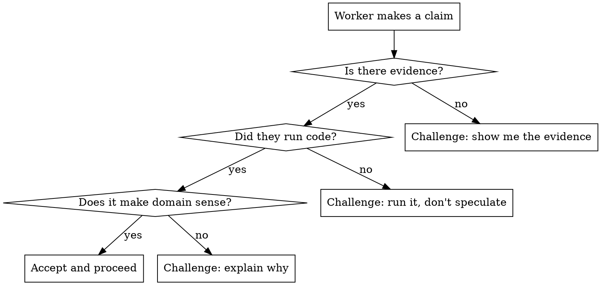

# Manage Brainstorming

## Overview

Guides a manager session through the lifecycle of monitoring worker agents that are brainstorming, investigating, or designing. The core tension: keep agents moving without interrupting deep work, while critically evaluating their claims instead of rubber-stamping everything.

**Core principle:** Trust but verify. Worker agents will confidently present wrong conclusions. Your job is to challenge complexity, demand evidence, and catch the moment they stop investigating and start hand-waving.

## When to Use

- You launched a worker with a brainstorming/investigation/debugging skill
- The worker is going through a multi-phase process (explore, question, propose, design, plan, implement)
- You need to answer questions, approve phases, and keep the worker moving
- Multiple workers are running in parallel on related problems

## Anti-Gaslight Guardrails

Worker agents will present findings with high confidence. This does NOT mean they are correct.



### Red flags to challenge

| Worker says | You should ask |
|---|---|
| "This is the root cause" (without running code) | "Show me the failing test or trace that proves it" |
| "All tests pass" (without showing output) | "Show me the actual test output" |
| "The fix is simple — just change X" | "What are the side effects? What else depends on X?" |
| "This is a known issue, I'll xfail it" | "Is it actually known, or are you avoiding a hard bug?" |
| "The remaining failures are unrelated" | "Prove it — run them and show they fail for a different reason" |
| "100% pass rate" | "With functional verification ON? Show the pipeline output" |
| "I fixed both bugs" | "Run the full regression suite and show me the numbers" |

### When NOT to challenge

- Worker is asking a clarifying question (answer it, don't interrogate)
- Worker shows actual code output proving their claim
- Worker is in early exploration phase (let them explore)
- The claim is about something you can independently verify later

## Monitoring Cadence

Adapt check frequency to the worker's phase:

| Phase | Interval | Why |
|---|---|---|
| Startup / exploring context | 2 min | May hit permissions or get stuck early |
| Asking clarifying questions | 30 sec | Needs answers quickly to keep moving |
| **Proposing approaches** | **30 sec max** | Worker presents options fast — manager must evaluate and choose promptly |
| **Presenting design sections** | **20 sec** | Worker iterates quickly — approvals should be near-instant |
| Writing design doc / plans | 3 min | Deep writing, don't interrupt |
| Executing subagents | 5-10 min | **DO NOT send messages** — interrupts subagents |
| Running tests | 5-10 min | Tests take time, no action needed |
| Idle for 5+ min | Immediate | Likely stuck, needs a nudge |
| Idle for 30+ min | Immediate | Definitely stuck |

**Key insight:** The brainstormer agent is fast at presenting approaches and design sections. The bottleneck is the manager's response time. Never set timers longer than 30s during interactive phases (approaches, design, questions).

### Implementation

Use background timers:
```
sleep N && echo "check-SESSION_ID-PHASE"
```
Run with `run_in_background=true`. You'll be notified when the timer completes.

## Keeping Workers Moving

### Answering questions

- Answer promptly — idle workers waste time
- Be decisive: "Yes, approach A. Proceed."
- Don't add unnecessary caveats that create confusion
- If you don't know the domain answer, escalate to the user

### Evaluating approaches (CRITICAL — do not auto-approve)

When the worker presents 2-3 approaches and recommends one:

1. **Read all approaches carefully** — do NOT rubber-stamp the recommended one
2. Evaluate each approach against the original requirements and constraints
3. Consider trade-offs the worker may have missed (blast radius, backward compat, DRY)
4. Pick the approach that makes most sense for the project, even if it's not the recommended one
5. If unsure, **escalate to the user** via `send_notification`:
   ```
   send_notification(
       title="Approach selection needed",
       body="Worker 'session-name' proposes 3 approaches for X. I'm unsure which fits best — #2 optimizes for Y but #3 is simpler. Need your input.",
       urgency="high",
       session_id=N
   )
   ```
6. Be decisive once you've thought it through: "Approach B. Proceed."

**Red flags for auto-approval:**
- You picked the recommended approach without reading the others
- You can't explain WHY the chosen approach is better than the alternatives
- The approaches involve trade-offs you don't have domain context for → escalate

### Approving design sections

When the worker presents design details section by section:
1. Scan for obvious issues (does it match the original requirements?)
2. Check the anti-gaslight guardrails above
3. Design sections are usually correct at this stage — approve promptly: "Looks good. Proceed."
4. Don't block on perfection — the worker will iterate

### Phase Transitions — NEVER Skip Steps

The brainstorming workflow has mandatory phases. When approving one phase, **always direct the worker to the next specific phase** — never say generic things like "proceed to implementation."

| When worker completes... | You say... | You NEVER say... |
|---|---|---|
| Design spec | "Spec looks good. Now write an implementation plan using /superpowers:writing-plans." | "Proceed to implementation." |
| Implementation plan | Review the plan carefully, then: "Plan approved. Execute it with /superpowers:subagent-driven-development." | "Looks good, go ahead and implement." |
| Spec self-review | "Self-review looks clean. I'll review the spec now." (then actually review it) | "Approved. Proceed." (without reading) |

**Why this matters:** Workers follow manager instructions literally. Saying "proceed to implementation" causes them to skip writing the implementation plan, skip the plan review phase, and jump straight to coding — losing the benefits of structured planning and parallel subagent execution. The plan-writing and plan-review phases exist so the manager can catch issues BEFORE code is written.

**The full post-spec sequence is:**
1. Worker writes spec → manager reviews spec
2. Worker writes implementation plan (using `/superpowers:writing-plans`) → **manager reviews plan**
3. Worker executes plan (using `/superpowers:subagent-driven-development`)

Every arrow is a checkpoint. Never collapse steps 1→3 by saying "proceed to implementation."

### Unsticking workers

Signs a worker is stuck:
- Status `idle` or `waiting` for 5+ minutes with no new events
- Repeating the same verification loop
- Asking a question that was already answered

How to unstick:
- Send a direct, actionable message: "Stop X. Do Y now."
- If a previous message interrupted a subagent, acknowledge it and redirect
- Don't re-explain context — the worker has it, it just needs a push

### Notifying the user

When a worker needs human input you cannot provide, notify the user via browser notification:

| Trigger | Urgency | Example body |
|---|---|---|
| Worker asks domain/clarifying question | `high` | "session-a asks: should auth use JWT or sessions?" |
| Worker proposes approaches, needs selection | `medium` | "session-a proposes 3 approaches for caching, awaiting choice" |
| Worker stuck/idle >5 minutes | `high` | "session-a idle 7min on feature/auth — may need a nudge" |
| Worker completes major milestone | `low` | "session-a finished auth implementation, tests passing" |

Use `send_notification(title, body, urgency, session_id)`. The notification appears as an OS-level popup even if the dashboard tab is backgrounded.

## Message Delivery

**CRITICAL:** `send_action` pastes text but may not submit it. Always verify delivery:

1. Send via `send_action(session_id, action="send", text="...")`
2. Check terminal output to confirm: `TMUX="" tmux -L agent-dashboard capture-pane -t SESSION -p | tail -5`
3. If you see `[Pasted text #N +X lines]` at the prompt, it wasn't submitted
4. Submit it: `TMUX="" tmux -L agent-dashboard send-keys -t SESSION Enter`
5. Verify it's processing: look for "esc to interrupt" in the output

## Subagent Execution — Do Not Interrupt

When a worker dispatches subagents (via `Agent()` tool or subagent-driven-development):

- **DO NOT send messages** — they interrupt the running subagent mid-work
- Check status only via `get_session` and `capture_session_output`
- Wait for the subagent to complete before sending anything
- If you accidentally interrupt, acknowledge it: "Sorry for the interruption. Continue where you left off."

## Parallel Workers

When running multiple workers on related problems:

- Track each in a status table
- Check them independently — don't batch updates
- When one finds something relevant to the other, relay the finding
- Don't merge findings prematurely — let each agent reach its own conclusion
- Converging conclusions from independent agents = high confidence

## Launching Brainstorming Workers

For any creative or design work (features, components, new functionality, behavior changes),
the manager MUST launch the worker with a prompt whose **first characters** are `/brainstorming`:

```
launch_session(
    worktree_id=N,
    prompt="/brainstorming <task description and context>",
    ...
)
```

This invokes `superpowers:brainstorming` as the very first thing the worker's session sees,
before the worker can rationalize its way past the design gate. Do NOT bury the directive
inside prose ("please use /brainstorming for this task") — the slash command must be
literal and first. Workers routinely skip guidelines embedded in prompts; a leading
slash command is mechanical and cannot be ignored.

This rule applies only to creative/design launches. Workers spun up to execute an
already-approved plan or to run mechanical tasks do not need this prefix.

## Monitor Sidecar Escalations

When workers are launched with a monitor sidecar (`monitor_level="full_auto"` or
`"permissions_only"`), the monitor watches Claude Code state changes and may forward
escalation messages to you. These arrive as:

```
[ESCALATION] Worker '{name}' (id={id})
---
{relevant excerpt from worker output}
---
```

For DONE notifications: `Worker '{name}' (id={id}) reports done.`
For STUCK escalations: `Worker '{name}' (id={id}) is stuck.` followed by context.

Escalation routing is driven mechanically by state changes (idle timeouts, permission
prompts, session status transitions) — not by markers emitted from within worker prompts.
This keeps the escalation chain robust even when a worker deviates from its skill
guidelines.

Treat an escalation the same as if you had discovered the issue by polling — answer the
question, challenge the claim, or unstick the worker.

## Common Mistakes

| Mistake | Fix |
|---|---|
| **Saying "proceed to implementation" after spec approval** | Always name the next phase explicitly: "Write an implementation plan using /superpowers:writing-plans" |
| **Skipping plan review** | After the worker writes a plan, READ it and approve before execution — don't auto-approve |
| **Auto-approving the recommended approach** | Read ALL approaches, think about trade-offs, pick the best one |
| **Setting 2-3 min timers during approach/design phases** | Use 30s max for approaches, 20s for design sections |
| Not escalating approach decisions when unsure | Use `send_notification` to ping the user — you're a manager, not a domain expert |
| Sending messages during subagent execution | Wait for subagent to finish, then send |
| Rubber-stamping "all tests pass" without output | Ask to see the actual numbers |
| Not verifying message delivery | Always check terminal after send_action |
| Checking too frequently during deep work | Use 5-10 min intervals for execution phases |
| Checking too infrequently during Q&A | Use 30s intervals when worker needs answers |
| Accepting xfail as a fix | Challenge: is this a real known issue or avoidance? |
| Forgetting to set the next timer | Always set the next check before responding |
