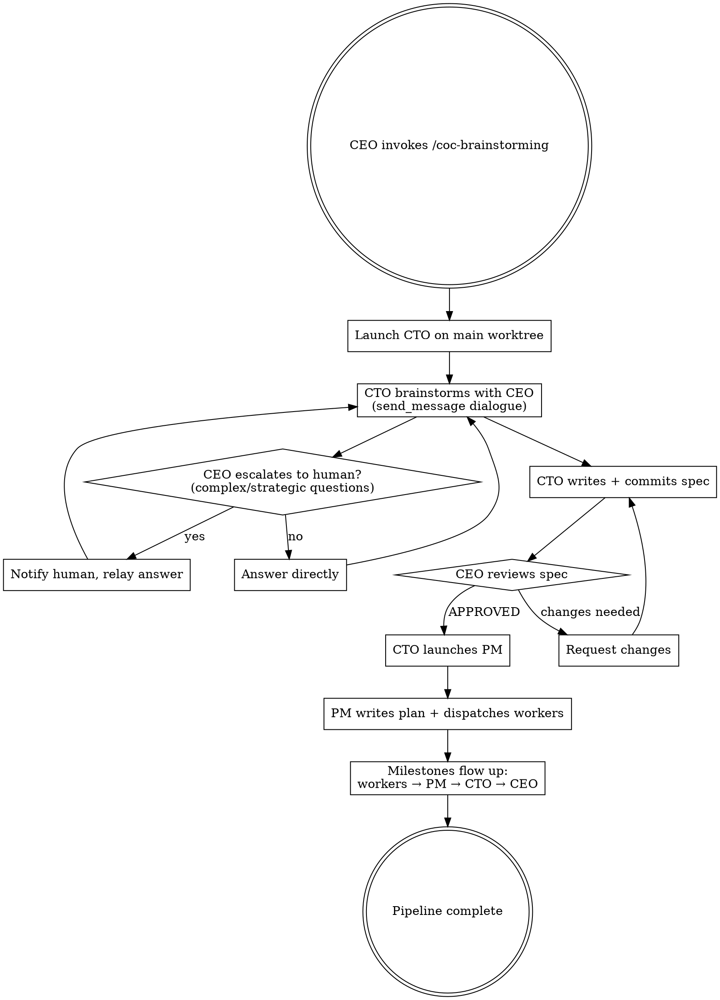

# Chain-of-Command Brainstorming

## Overview

Orchestrates the full idea-to-execution pipeline through the org hierarchy: CEO → CTO (brainstorm → design spec) → PM (implementation plan → parallel worker dispatch). The CEO participates in brainstorming dialogue, gates the design spec, and receives milestone notifications. Everything downstream runs autonomously.

## Trigger

Invoked as `/coc-brainstorming <topic>` where topic is a short description (e.g., "build a widget embedding system").

## Flow



## CEO Protocol

### Step 1: Launch the CTO

Use the prompt template below. Replace `{ceo_session_id}`, `{main_worktree_id}`, and `{topic}`.

Launch without a monitor (managers don't need monitors). Use `model="opus"`.

```
launch_session(
    worktree_id={main_worktree_id},
    prompt=CTO_PROMPT_TEMPLATE,
    model="opus",
    permission_mode="default",
    name="cto-{topic-slug}"
)
```

### Step 2: Start monitor loop

```
Bash(command="sleep 300 && echo 'MONITOR CHECK'", run_in_background=true)
```

### Step 3: Handle brainstorming dialogue

CTO sends clarifying questions via `send_message`. For each question:
- If you can answer from product vision/strategy: answer directly via `send_action`
- If it requires human judgment (market positioning, budget, strategic trade-offs): escalate via `send_notification(urgency="high")`, wait for human, relay answer

### Step 4: Gate the design spec

CTO sends the spec path + summary. Read the spec. Reply with either:
- `APPROVED` — CTO proceeds to launch PM
- `CHANGES REQUESTED: <specific issues>` — CTO revises (max 3 iterations, then escalate to human)

### Step 5: Track milestones

| # | Milestone | Source | CEO action |
|---|-----------|--------|------------|
| M1 | CTO launched | CEO | Start monitor loop |
| M2 | Brainstorming dialogue | CTO → CEO | Answer questions |
| M3 | Spec ready for review | CTO → CEO | Read spec, approve or request changes |
| M4 | PM launched | CTO → CEO | Note PM session ID |
| M5 | Plan written | PM → CTO → CEO | Informational |
| M6 | Workers launched | PM → CTO → CEO | Note worker count |
| M7 | All workers done | PM → CTO → CEO | Pipeline complete |

## CTO Launch Prompt Template

```
You are the CTO of Optetron. Use /manager to establish your manager session, then use /role-cto to adopt your role.

Your manager is the CEO, session {ceo_session_id}. Communicate via send_message(session_id={ceo_session_id}, ...).

DIRECTIVE: coc-brainstorming: {topic}

This is a chain-of-command brainstorming directive. Your mission:

1. BRAINSTORM: Use superpowers:brainstorming to explore "{topic}"
   - Send clarifying questions to CEO (session {ceo_session_id}) via send_message
   - Wait for CEO responses before proceeding on ambiguous points
   - Focus on architecture, components, data flow, testing strategy

2. WRITE SPEC: Write the design spec to docs/superpowers/specs/ and commit it
   - Send the spec path + a 3-5 line summary to CEO for approval
   - Wait for CEO to reply with "APPROVED" or "CHANGES REQUESTED"
   - If changes requested: revise, recommit, resubmit

3. LAUNCH PM: After CEO approval, launch a PM session on the main worktree (id={main_worktree_id})
   - Use /role-pm, tell PM your session ID and CEO session ID
   - PM directive: "coc-execution: <spec-path>"
   - PM model: opus, no monitor (managers don't need monitors)

4. MONITOR: Track PM progress, relay milestones to CEO
   - Use the self-waking monitor loop (sleep 300 background timers)
   - Relay: plan written, workers launched, worker completions, all done

CONSTRAINTS:
- Do NOT skip the CEO approval gate on the spec
- Do NOT launch workers directly — that is the PM's job
- Use model="opus" for all sessions (no version suffixes)
```

## Human Escalation

```
send_notification(
    title="Brainstorming needs human input",
    body="CTO asks: {question}. Topic: {topic}. Reply to CEO session {ceo_session_id}.",
    urgency="high",
    session_id={cto_session_id}
)
```

## Failure Recovery

- **CTO crashes:** CEO relaunches CTO with same prompt + "Check docs/superpowers/specs/ for any partially written spec from a prior session"
- **PM crashes:** CTO relaunches PM with same directive + "Check for existing plan or worker worktrees from a prior session"
- **Worker crashes:** PM relaunches on existing worktree (standard PM recovery protocol)
- **Spec rejected 3+ times:** CEO escalates to human via `send_notification(urgency="high")`
