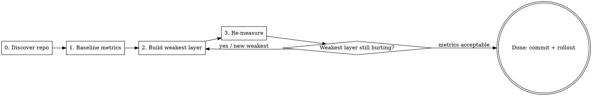

# harness-setup

Set up an optimized Claude Code **harness** for an existing repo — the config that controls how agents store, retrieve, present, and act on repo context (`CLAUDE.md` hierarchy, `settings.json`, hooks, subagents, skills, ignore rules).

## Core Principle

A harness is an **optimizable artifact with a scoring loop**, not a one-shot setup (Meta-Harness, arXiv 2603.28052: end-to-end harness optimization beat hand-engineered baselines with up to 75% fewer tokens). You cannot optimize what you have not measured against a real repo.

**The Iron Rule: inspect the actual repo and record baseline metrics BEFORE writing any harness file.** A template dump generated from the user's description (guessed build commands, guessed package list, no metrics) is the failure this skill exists to prevent. No exceptions — not for "obvious" stacks, not to "save a step".

## When to Use

- New Claude Code adoption on an existing codebase, especially large/polyglot/monorepo
- Symptoms: agents get lost, context blowups, permission-prompt spam, generic non-repo-specific answers
- NOT for greenfield repos with no code yet → use plain `/init`
- NOT for tuning a single CLAUDE.md → just edit it

## The Loop

Build one layer, re-measure, repeat on whatever is now worst. Do **not** build all five layers blind.

## Phase 0 — Discover the real repo (never skip)

Run against the actual repo, not the user's description:

| Goal | Command |
|------|---------|
| Size / languages | `tokei` or `cloc .`, `git ls-files \| sed 's/.*\.//' \| sort \| uniq -c \| sort -rn` |
| Top-level structure | `git ls-files \| cut -d/ -f1 \| sort -u`; find per-package manifests (`package.json`, `pyproject.toml`, `go.mod`, `*.tf`) |
| Build/test commands | Read CI: `.github/workflows/*`, `Makefile`, `nx.json`/`pants.toml`/`turbo.json` — use the **real** commands, do not guess |
| Existing harness | `find . -name CLAUDE.md -o -name AGENTS.md`; `cat .claude/settings*.json`; existing `.gitignore` |
| Context bloat sources | Largest tracked dirs; generated/vendored/lockfile paths |

## Phase 1 — Baseline metrics (the numbers you iterate on)

Record three numbers before changing anything:

1. **Context cost**: token size of everything always loaded (root `CLAUDE.md` + always-on skills/imports). `wc -w` × ~1.3 as a proxy.
2. **Permission friction**: count distinct denied/prompted Bash patterns from a few real sessions (`/fewer-permission-prompts` scans transcripts for this).
3. **Task grounding**: run 2–3 representative real tasks; note where the agent guessed, got lost, or answered generically.

These are your scoreboard. Every later change must move one of them.

## The five harness layers

Map each symptom to the layer; build the layer the baseline says is worst first.

| Layer | Symptom it fixes | Artifacts |
|-------|------------------|-----------|
| **Storage** (memory) | Lost, generic answers | Root `CLAUDE.md` (routing, <150 lines) + per-package `CLAUDE.md` (local truth, real commands) |
| **Retrieval** (scoping) | Context blowups | `.gitignore`/ignore rules for generated/vendored/lockfiles; `@imports` for lazy detail; "one package per session" rule |
| **Presentation** (delegation) | Context blowups on exploration | `.claude/agents/*` locator + test-runner subagents that return summaries, not file dumps |
| **Tools** (permissions) | Permission spam | `.claude/settings.json` allow/deny/ask (committed) + `settings.local.json` (gitignored) |
| **Enforcement** (hooks) | Drift, dangerous commands, style churn | `.claude/settings.json` hooks: PostToolUse format/lint, PreToolUse deny-backstop |

Reuse existing skills instead of reinventing: `/init` to draft each `CLAUDE.md` (then trim hard), `/fewer-permission-prompts` to derive the allowlist from real transcripts, `update-config` for `settings.json`/hooks, `superpowers:writing-skills` for any repo-local workflow skill. Do not hand-write what these generate.

## Phase 3 — Re-measure and iterate

After each layer: re-run the three measurements. Keep a one-line log: `layer → metric before → after`. Stop when all three numbers are acceptable to the user, not when "all layers exist". The deliverable is the metric delta, not the file count.

## Rollout

Land the harness in one PR. Pilot with 3–4 engineers for a week with `settings.local.json` overrides; fold their real allows back via `/fewer-permission-prompts`. Add a short `docs/claude-code.md` (golden rules, one-package-per-session, explore-via-subagent, how to add a permission). Treat root `CLAUDE.md` + `settings.json` as living files reviewed in normal PRs.

## Common Mistakes

| Mistake | Fix |
|---------|-----|
| Generating files from the user's description without inspecting the repo | Phase 0 first. Use real package list and real CI commands. |
| Guessing build/test commands | Read CI/Makefile; copy the exact command. |
| Building all five layers up front | Build the one the baseline says is worst; re-measure; repeat. |
| "Tune from failures later" with no mechanism | Phase 1 metrics ARE the mechanism. Record them or you are not optimizing. |
| Bloated root `CLAUDE.md` (300 lines from `/init`) | Root is routing only, <150 lines; push detail to per-package files and `@imports`. |
| Re-hand-writing permission lists / CLAUDE.md | Use `/fewer-permission-prompts`, `/init`, `update-config`. |
| Declaring done because all files exist | Done = the three baseline numbers improved and the user accepts them. |

## Red Flags — stop

- About to write `CLAUDE.md`/`settings.json` and you have not run Phase 0 commands on this repo
- You typed a build command you did not read out of CI/Makefile
- No baseline numbers recorded → you have nothing to optimize against
- Producing the full deliverable kit in one pass with no measurement between layers

All of these mean: stop, run discovery + baseline, build one layer, measure.
